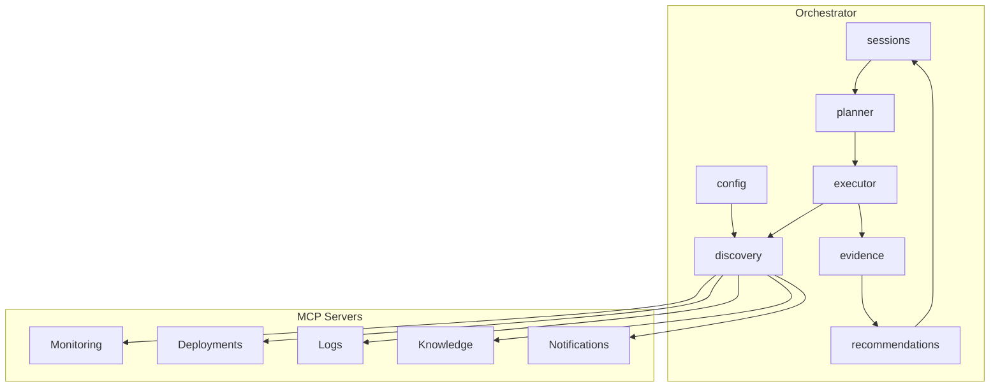

# Incident Pilot Orchestrator

Enterprise-style orchestrator that coordinates multi-domain incident investigations across MCP servers.

The orchestrator discovers downstream MCP capabilities, plans investigation workflows, executes tool calls, collects auditable evidence, and produces actionable recommendations.

## Architecture



## Package layout

```text
apps/orchestrator/
├── app.go                  # Composition root + investigation pipeline
├── app_test.go             # End-to-end test with in-process MCP cluster
├── cmd/orchestrator/main.go
├── config/                 # Orchestrator + MCP endpoint configuration
├── discovery/              # MCP server discovery and client pool
├── sessions/               # Investigation session lifecycle + store
├── planner/                # Rule-based investigation plan builder
├── executor/               # Plan step execution via MCP tools
├── evidence/               # Evidence model + collector
└── recommendations/        # Rule-based recommendation engine
```

## Layer responsibilities

| Layer | Role | Extension point |
|-------|------|-----------------|
| `config` | MCP URLs, default service, logging | Add RBAC policies, feature flags |
| `discovery` | Connect to MCP servers, list tools | Service mesh, health checks, retries |
| `sessions` | Track investigation state and results | Persist to DB, audit log export |
| `planner` | Build multi-step investigation plans | Replace with LLM planner |
| `executor` | Call MCP tools in plan order | Parallel execution, circuit breakers |
| `evidence` | Normalize tool output into evidence items | Evidence scoring, deduplication |
| `recommendations` | Derive actions from evidence | LLM reasoning, approval workflows |

## Investigation pipeline

1. **Discover** — connect to all configured MCP servers and catalog tools.
2. **Session** — create an investigation session for the target service.
3. **Plan** — build a cross-domain plan (monitoring → deployments → logs → knowledge → notifications).
4. **Execute** — run each step via the MCP client pool.
5. **Evidence** — collect structured evidence from tool results.
6. **Recommend** — produce prioritized, approval-aware recommendations.
7. **Complete** — persist session with full audit trail.

## Run locally

Start all MCP servers (separate terminals):

```bash
make run-monitoring
make run-deployments
make run-logs
make run-knowledge
make run-notifications
```

Run the orchestrator:

```bash
make run-orchestrator
# or with a specific service
go run ./apps/orchestrator/cmd/orchestrator -service payment-api
```

### MCP endpoint configuration

| Flag / Env | Default |
|------------|---------|
| `-mcp-monitoring` / `MCP_MONITORING_URL` | `http://localhost:8081` |
| `-mcp-deployments` / `MCP_DEPLOYMENTS_URL` | `http://localhost:8082` |
| `-mcp-logs` / `MCP_LOGS_URL` | `http://localhost:8083` |
| `-mcp-knowledge` / `MCP_KNOWLEDGE_URL` | `http://localhost:8084` |
| `-mcp-notifications` / `MCP_NOTIFICATIONS_URL` | `http://localhost:8085` |
| `-service` / `INCIDENT_SERVICE` | `payment-api` |

## Tests

```bash
go test ./apps/orchestrator/... -v
```

The end-to-end test spins up all five MCP servers in-process and runs a full investigation.

## Design notes

- The orchestrator is **MCP-client-only** — it does not expose MCP itself; it consumes MCP from domain servers.
- `planner` and `recommendations` are rule-based today, structured for future LLM integration.
- Every recommendation links back to `evidence_ids` for auditability.
- Approval-gated actions (`requires_approval`) align with the notifications server's approval workflow.
