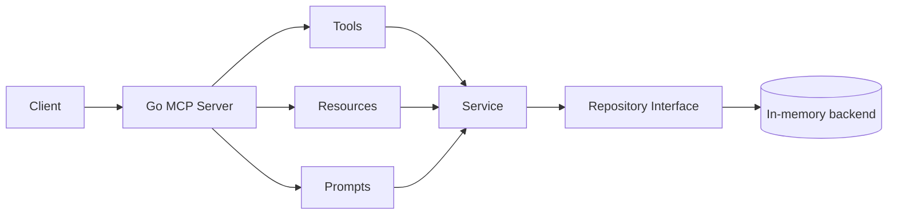

# Monitoring MCP Server

This service provides a production-oriented MCP server for monitoring and incident triage workflows.

It exposes:
- tools for querying live monitoring context,
- resources for structured snapshots,
- prompts for guided investigation flows.

The implementation uses the official Go MCP SDK (`github.com/modelcontextprotocol/go-sdk/mcp`).

## Why this structure

The goal is to keep the server easy to extend as requirements grow (authorization, policy checks, new data backends, more tools/resources/prompts) without rewriting core pieces.

The composition root wires small focused packages:

- `config` for runtime configuration.
- `repository` for data access contracts and implementations.
- `service` for business logic and validations.
- `tools`, `resources`, `prompts` for MCP feature surfaces.
- shared config in `shared/config` for flags, env vars, and auth settings.
- shared transport runner in `shared/transport` to avoid duplication across MCP servers.

## Package layout

```text
servers/monitoring/
├── app.go
├── app_test.go
├── cmd/monitoring/main.go
├── config/
│   └── config.go
├── prompts/
│   └── prompts.go
├── repository/
│   ├── repository.go
│   └── memory/
│       └── memory.go
├── resources/
│   └── resources.go
├── service/
│   └── service.go
└── tools/
    ├── alerts.go
    ├── errors.go
    ├── metrics.go
    ├── registry.go
    └── services.go
```

Shared runtime (used by all MCP servers):

```text
shared/
├── config/config.go      # flags, env vars, auth config
├── transport/runner.go   # HTTP/stdio + auth middleware hook
└── logging/log.go        # structured logging
```

## Layer responsibilities

### 1) `config`
- Loads flags and environment variables.
- Centralizes operational defaults (address, log file, transport mode, shutdown timeout).
- Holds auth-related config so auth can be enabled without changing feature code.

### 2) `repository`
- Defines domain entities (`Service`, `MetricPoint`, `Alert`) and `Repository` interface.
- Contains data access implementation(s).
- Current implementation: `repository/memory`, seeded with realistic incident-like sample data.
- Future implementations can include Prometheus, Datadog, CloudWatch, etc.

### 3) `service`
- Owns business logic and validation (for example, required IDs/names).
- Keeps MCP handlers thin and transport-agnostic.
- Best place for future RBAC/policy checks and audit hooks.

### 4) `tools`
- Registers and implements MCP tools:
  - `list_services`
  - `get_service_metrics`
  - `list_alerts`
  - `get_alert`
- Converts service errors into MCP tool errors.
- Should remain orchestration glue; heavy logic belongs in `service`.

### 5) `resources`
- Registers MCP resources for structured machine-readable snapshots:
  - `monitoring://catalog/services`
  - `monitoring://services/{name}`
- Good fit for data the model should fetch as documents rather than tool calls.

### 6) `prompts`
- Registers reusable MCP prompt templates.
- Current prompt: `investigate_incident`.
- Encodes investigation guidance with live service/alert/metric context.

### 7) transport in `shared/transport` (common)
- Runs MCP server over `http` or `stdio`.
- Handles graceful shutdown.
- Contains a pluggable auth middleware hook (API key today, OAuth/RBAC later).
- Shared so every future MCP server can reuse the same runtime behavior.

## Request flow



## Key extension points

1. **Swap storage/backend**
   - Implement `repository.Repository`.
   - Inject it via `monitoring.New(cfg, &monitoring.Options{Repository: yourRepo})`.

2. **Add authorization**
   - Extend config and middleware logic in `shared/transport/runner.go`.
   - Add policy checks in `service` for fine-grained authorization.

3. **Add MCP features**
   - New tool: add a file under `tools/` and register in `tools/registry.go`.
   - New resource: add in `resources/`.
   - New prompt: add in `prompts/`.

4. **Add observability**
   - Keep transport logs in shared runtime.
   - Add service-level structured logs and audit trails in `service`.

## Running locally

From repository root:

```bash
make run-monitoring
```

Or directly:

```bash
go run ./servers/monitoring/cmd/monitoring
```

Useful flags:

```bash
go run ./servers/monitoring/cmd/monitoring \
  -transport http \
  -addr :8081 \
  -log-file /tmp/monitoring-mcp.log \
  -auth-enabled=false
```

Useful environment variables:
- `MCP_TRANSPORT` (`http` or `stdio`)
- `MCP_ADDR` (for HTTP mode)
- `LOG_FILE`
- `MCP_AUTH_ENABLED`
- `MCP_AUTH_API_KEY`

## Tests

Run monitoring tests:

```bash
go test ./servers/monitoring/... -v
```

The end-to-end test exercises:
- tool calls,
- resource reads,
- prompt retrieval,
- and error paths for invalid requests.

## Design notes for learners

- Prefer **explicit boundaries** over convenience imports between layers.
- Keep **validation in `service`**, not in transport or tool handlers.
- Keep MCP-facing handlers thin and deterministic.
- Model additions should usually start as:
  1. domain type changes in `repository`,
  2. business logic in `service`,
  3. exposure through `tools/resources/prompts`.
- Treat transport as infrastructure; do not leak transport details into business logic.
