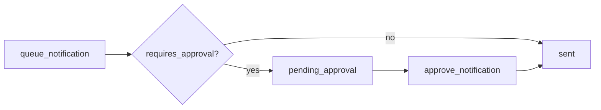

# Notifications MCP Server

MCP server for incident communications with approval-aware notification workflows.

**Default port:** `:8085`

## MCP surface

| Type | Name | Description |
|------|------|-------------|
| Tool | `list_channels` | Available channels (Slack, PagerDuty, email) |
| Tool | `list_notifications` | Sent and queued notifications |
| Tool | `get_notification` | Full notification record by ID |
| Tool | `queue_notification` | Queue a notification (optionally requires approval) |
| Tool | `list_pending_approvals` | Notifications awaiting human approval |
| Tool | `approve_notification` | Approve and send a pending notification |
| Resource | `notifications://channels/catalog` | JSON channel catalog |
| Resource | `notifications://pending/approvals` | Pending approval queue |
| Prompt | `draft_incident_update` | Draft stakeholder updates with channel guidance |

## Package layout

```text
servers/notifications/
├── app.go
├── app_test.go
├── cmd/notifications/main.go
├── config/
├── prompts/
├── repository/ (+ memory/)
├── resources/
├── service/
└── tools/
```

Shared runtime: `shared/config`, `shared/transport`, `shared/logging`

## Layer responsibilities

| Layer | Role |
|-------|------|
| `config` | Server-specific defaults (name, port, log file) |
| `repository` | Channels, notifications, approval state |
| `service` | Validation, approval rules, audit-friendly operations |
| `tools` | MCP tool handlers |
| `resources` | MCP resources for channel and approval snapshots |
| `prompts` | Guided incident communication drafting |
| `shared/transport` | HTTP/stdio serving and auth middleware hook |

## Approval workflow

High-impact channels (e.g. executive email, PagerDuty) should be queued with `requires_approval=true`. The orchestrator or operator then calls `approve_notification` with an approver identity before delivery.



## Run locally

```bash
make run-notifications
# or
go run ./servers/notifications/cmd/notifications
```

## Tests

```bash
go test ./servers/notifications/... -v
```

## Extension points

- Integrate real Slack, PagerDuty, and email providers behind `repository`.
- Enforce RBAC in `service` (who can approve which channels).
- Persist audit logs for every queue and approve action.
